# UserVault 合约详细流程图

本文档包含 UserVault 合约的所有核心功能的详细流程图。

## 目录

1. [整体架构流程图](#整体架构流程图)
2. [用户充值流程图](#用户充值流程图)
3. [用户提现流程图](#用户提现流程图)
4. [Operator 充值流程图](#operator-充值流程图)
5. [Operator 转账流程图](#operator-转账流程图)
6. [多签提案流程图](#多签提案流程图)
7. [合约状态转换图](#合约状态转换图)
8. [防重复机制流程图](#防重复机制流程图)

---

## 整体架构流程图

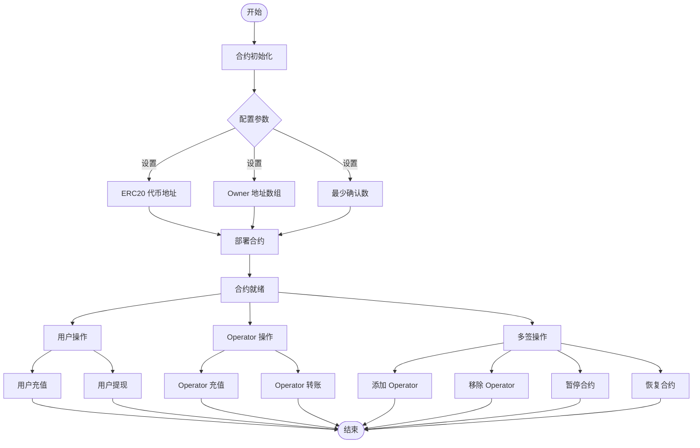

---

## 用户充值流程图

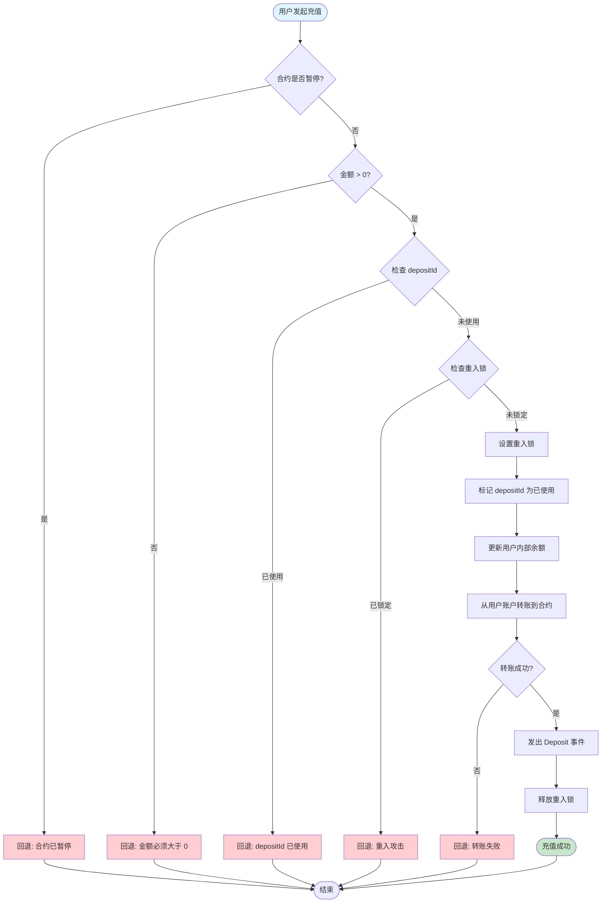

### 用户充值详细步骤

1. **前置检查**
   - 检查合约是否暂停 (`whenNotPaused`)
   - 检查金额是否大于 0
   - 检查 `depositId` 是否已使用
   - 检查重入锁状态 (`nonReentrant`)

2. **状态更新** (Checks → Effects)
   - 标记 `depositId` 为已使用
   - 更新用户内部余额：`balances[user] += amount`

3. **外部交互** (Interactions)
   - 从用户账户转账到合约：`token.transferFrom(user, contract, amount)`

4. **事件发出**
   - 发出 `Deposit` 事件

5. **清理**
   - 释放重入锁

---

## 用户提现流程图

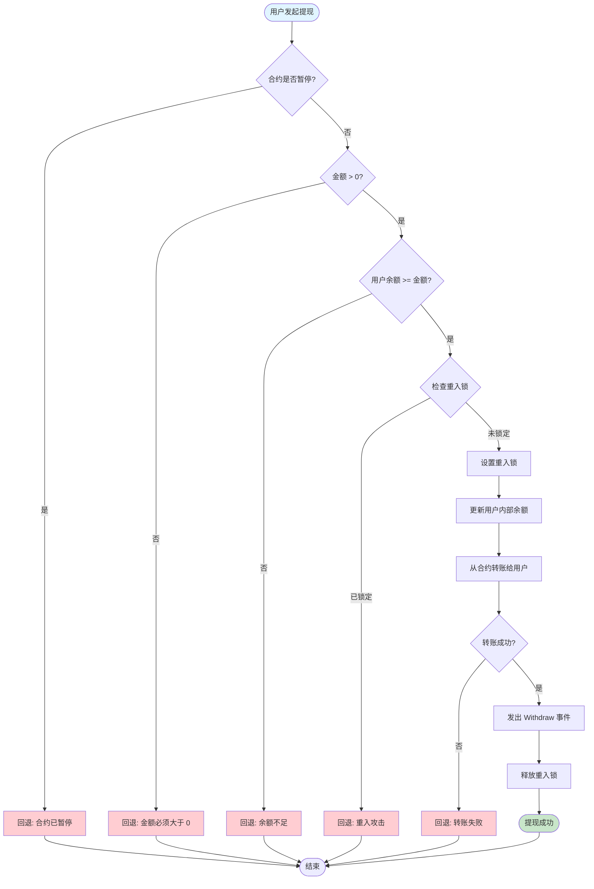

### 用户提现详细步骤

1. **前置检查**
   - 检查合约是否暂停
   - 检查金额是否大于 0
   - 检查用户余额是否足够
   - 检查重入锁状态

2. **状态更新** (Checks → Effects)
   - 更新用户内部余额：`balances[user] -= amount`

3. **外部交互** (Interactions)
   - 从合约转账给用户：`token.transfer(user, amount)`

4. **事件发出**
   - 发出 `Withdraw` 事件

5. **清理**
   - 释放重入锁

---

## Operator 充值流程图

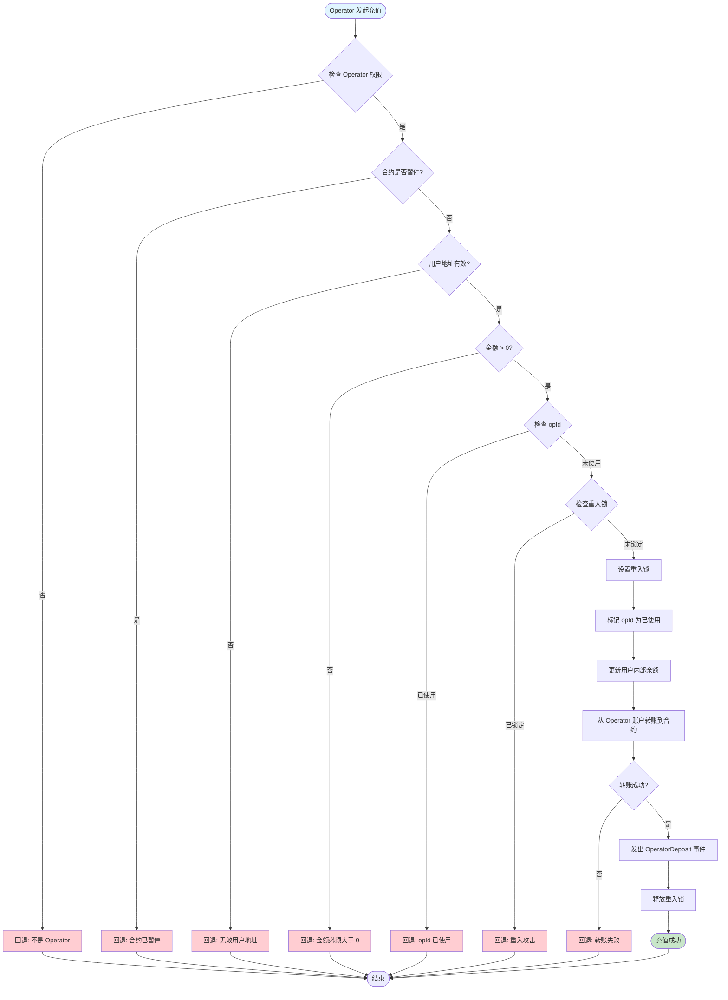

---

## Operator 转账流程图

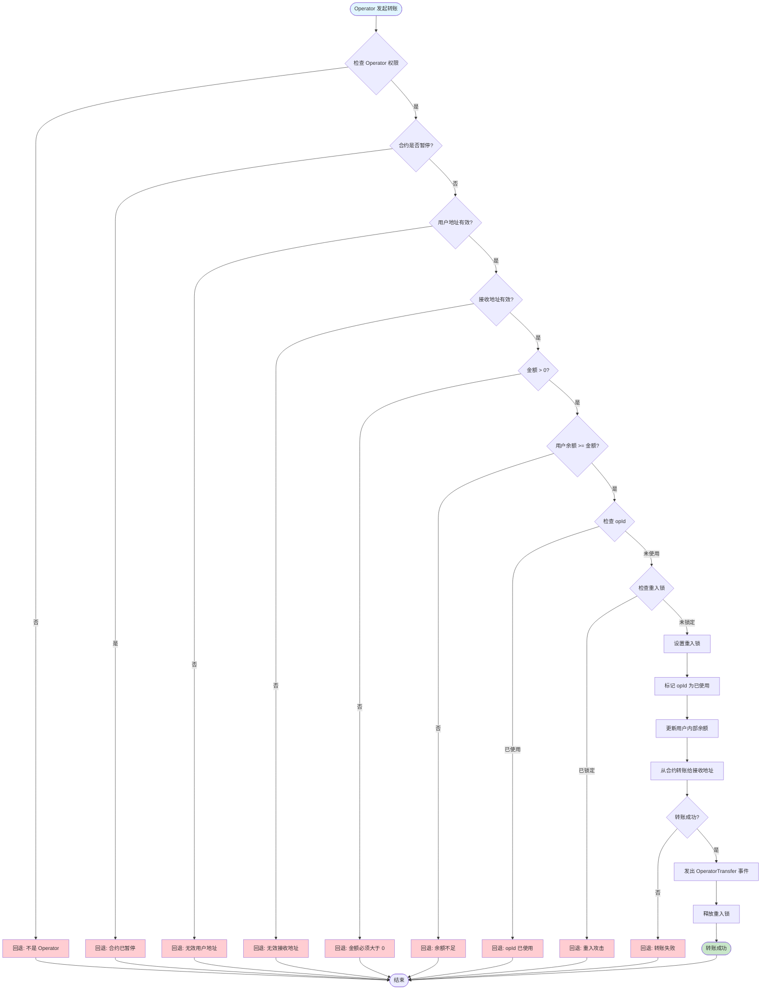

---

## 多签提案流程图

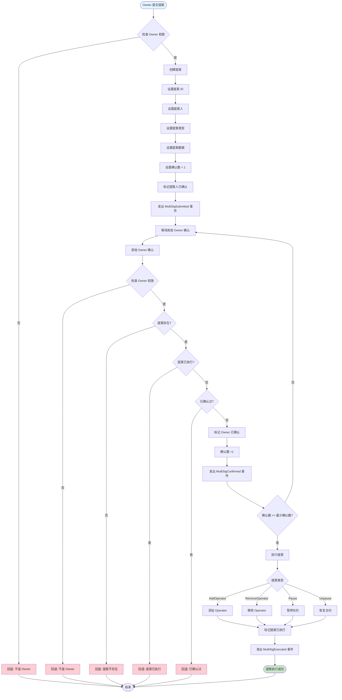

### 多签提案详细步骤

#### 1. 提交提案阶段

```
Owner → submitProposal()
  ├─ 检查：是否为 Owner
  ├─ 创建提案
  │   ├─ proposalId = ++proposalCounter
  │   ├─ proposer = msg.sender
  │   ├─ proposalType = 参数
  │   ├─ data = 参数
  │   ├─ confirmations = 1
  │   └─ confirmedBy[msg.sender] = true
  └─ 发出 MultiSigSubmitted 事件
```

#### 2. 确认提案阶段

```
Owner → confirmProposal(proposalId)
  ├─ 检查：是否为 Owner
  ├─ 检查：提案是否存在
  ├─ 检查：提案是否已执行
  ├─ 检查：是否已确认过
  ├─ 更新状态
  │   ├─ confirmedBy[msg.sender] = true
  │   └─ confirmations++
  ├─ 发出 MultiSigConfirmed 事件
  └─ 如果确认数足够 → 自动执行
```

#### 3. 执行提案阶段

```
executeProposal(proposalId)
  ├─ 检查：提案是否存在
  ├─ 检查：提案是否已执行
  ├─ 检查：确认数是否足够
  ├─ 标记已执行
  ├─ 根据类型执行操作
  │   ├─ AddOperator → _addOperator()
  │   ├─ RemoveOperator → _removeOperator()
  │   ├─ Pause → _pause()
  │   └─ Unpause → _unpause()
  └─ 发出 MultiSigExecuted 事件
```

---

## 合约状态转换图

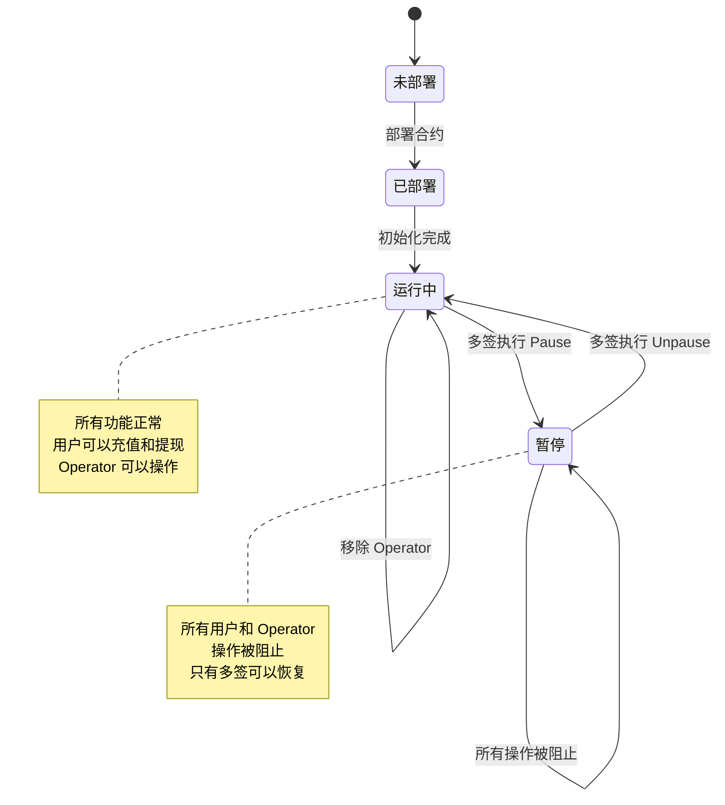

---

## 防重复机制流程图

### 用户充值防重机制

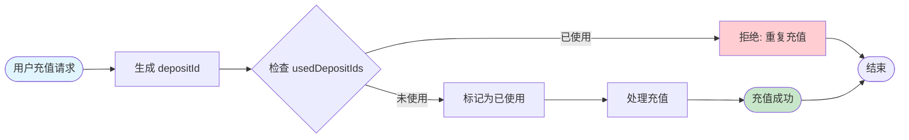

### Operator 操作防重机制

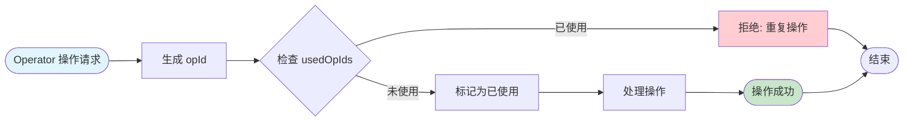

---

## 完整交互序列图

### 用户充值完整流程

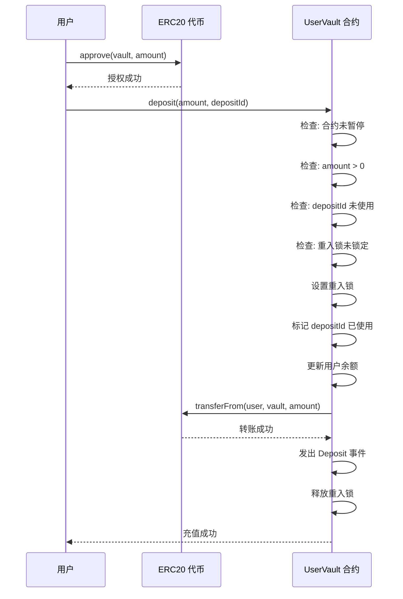

### 多签添加 Operator 完整流程

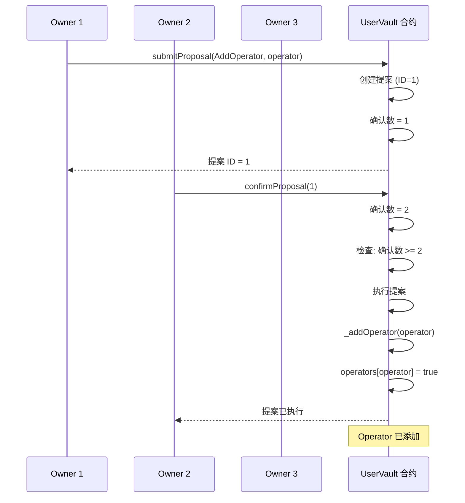

---

## 数据流图

### 用户余额管理数据流

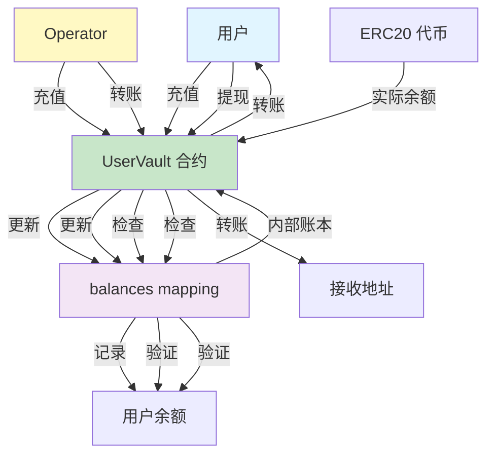

---

## 权限控制流程图

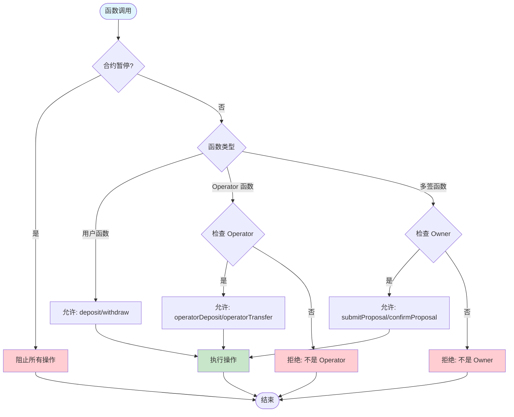

---

## 错误处理流程图

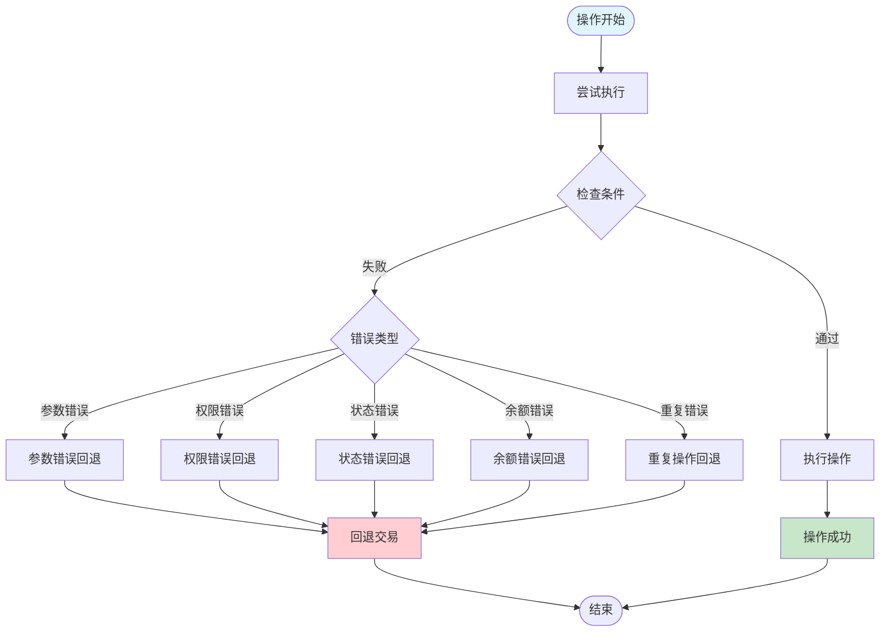

---

## 总结

### 核心设计原则

1. **Checks → Effects → Interactions**
   - 先检查条件
   - 再更新状态
   - 最后进行外部交互

2. **防重入保护**
   - 所有涉及转账的函数都使用 `nonReentrant`
   - 确保状态更新在外部调用之前

3. **防重复机制**
   - 用户充值使用 `depositId`
   - Operator 操作使用 `opId`
   - 所有 ID 只能使用一次

4. **多签控制**
   - 关键操作必须通过多签
   - N-of-M 机制确保安全性
   - 自动执行机制提高效率

5. **状态管理**
   - 暂停/恢复机制
   - 权限分级管理
   - 余额一致性保证

### 关键检查点

- ✅ 合约暂停状态检查
- ✅ 金额有效性检查
- ✅ 余额充足性检查
- ✅ 权限验证
- ✅ 重复操作检查
- ✅ 重入攻击防护
- ✅ 地址有效性检查

---

## 流程图说明

本文档使用 Mermaid 语法绘制流程图。如果您的 Markdown 查看器不支持 Mermaid，可以使用以下工具查看：

1. **在线查看器**: https://mermaid.live/
2. **VS Code 插件**: Markdown Preview Mermaid Support
3. **GitHub**: GitHub 原生支持 Mermaid 图表

---

## 相关文档

- [README.md](./README.md) - 合约功能说明
- [DEPLOYMENT.md](./DEPLOYMENT.md) - 部署指南
- [TEST_REPORT.md](./TEST_REPORT.md) - 测试报告
