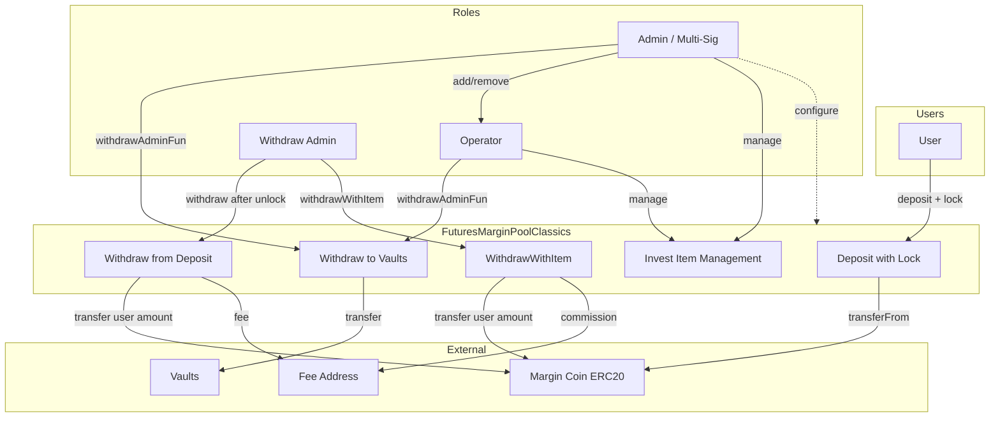
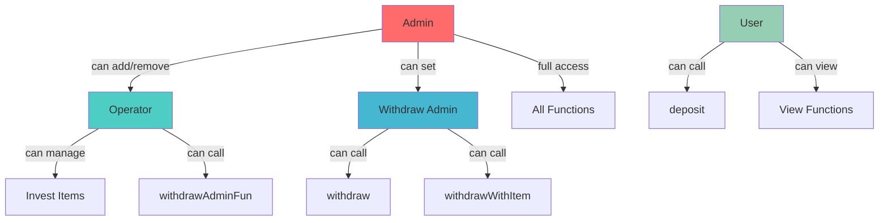
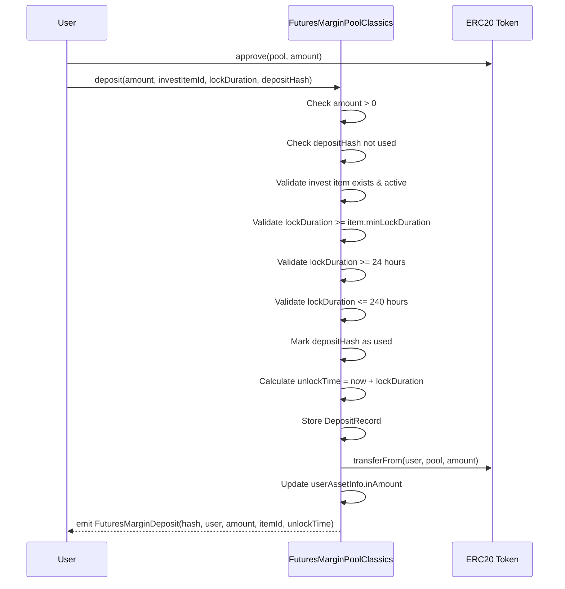
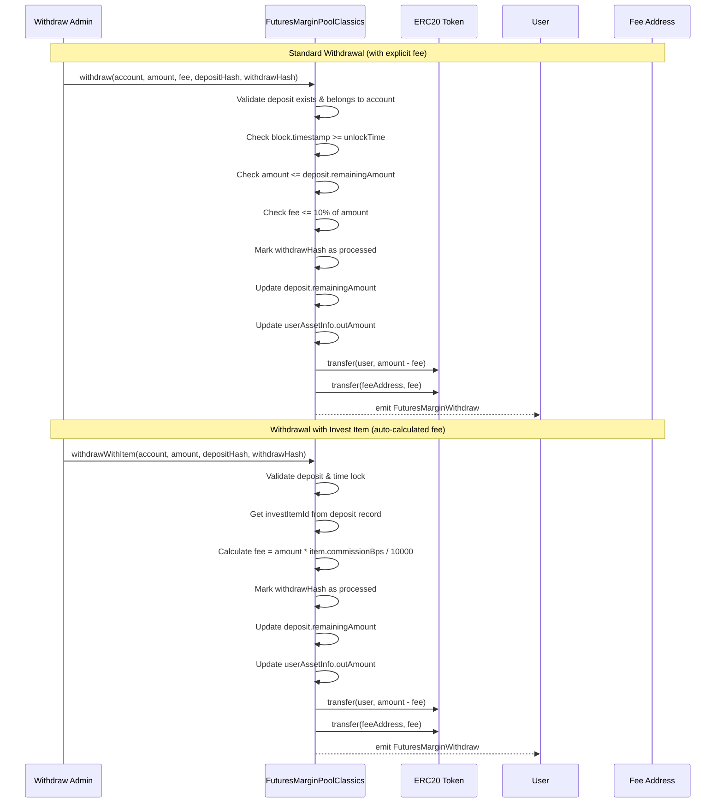
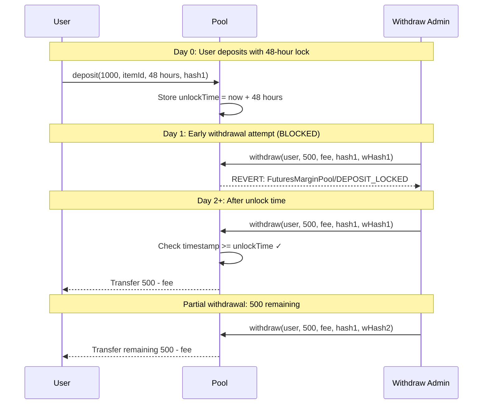
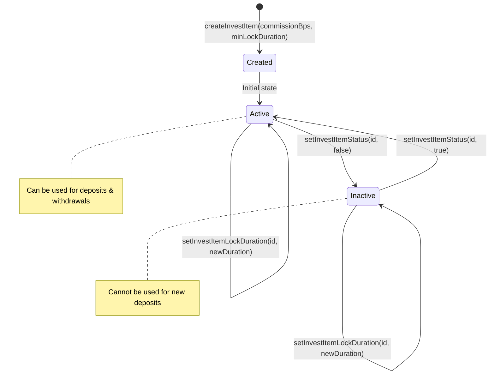
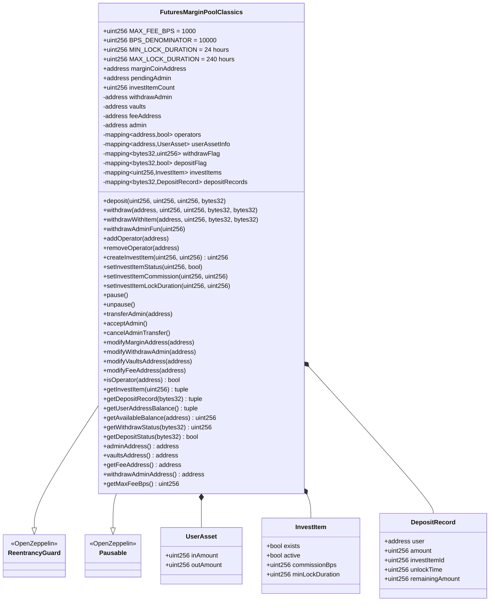

# Kuant-User-Vault-Management

A Solidity smart contract project for futures margin pool management with role-based access control, invest item management, configurable commission rates, and per-deposit time locks.

## Core Features

- **Margin Pool Management**: Secure deposit and withdrawal of ERC20 tokens for futures trading
- **Role-Based Access Control**: Admin, Operator, and WithdrawAdmin roles with distinct permissions
- **Operator System**: Operators can manage invest items and perform admin withdrawals
- **Invest Items**: Configurable investment products with individual commission rates and lock durations
- **Per-Deposit Time Lock**: Each deposit has its own lock period (24-240 hours), preventing early withdrawal
- **Per-Item Commission**: Each invest item has its own commission rate (in basis points)
- **Fee Management**: Configurable fee collection on withdrawals (max 10%)
- **Partial Withdrawals**: Support for withdrawing portions of a deposit after unlock
- **Withdrawal Deduplication**: Hash-based tracking to prevent duplicate withdrawals
- **Pause Mechanism**: Emergency pause functionality for deposits and withdrawals
- **Two-Step Admin Transfer**: Secure admin ownership transfer with acceptance requirement
- **Reentrancy Protection**: Built-in security using OpenZeppelin's ReentrancyGuard
- **Multi-Sig Compatible**: Admin can be a multi-signature wallet (e.g., Gnosis Safe)

## Architecture

### System Overview



### Role Hierarchy



### Deposit Flow with Time Lock



### Withdrawal Flows



### Time Lock Mechanism



### Invest Item Lifecycle



### Smart Contract Structure



## Access Control Matrix

| Function | Admin | Operator | WithdrawAdmin | User |
|----------|:-----:|:--------:|:-------------:|:----:|
| `deposit` | - | - | - | Yes |
| `withdraw` | - | - | Yes | - |
| `withdrawWithItem` | - | - | Yes | - |
| `withdrawAdminFun` | Yes | Yes | - | - |
| `addOperator` | Yes | - | - | - |
| `removeOperator` | Yes | - | - | - |
| `createInvestItem` | Yes | Yes | - | - |
| `setInvestItemStatus` | Yes | Yes | - | - |
| `setInvestItemCommission` | Yes | Yes | - | - |
| `setInvestItemLockDuration` | Yes | Yes | - | - |
| `pause/unpause` | Yes | - | - | - |
| `transferAdmin` | Yes | - | - | - |
| `modifyWithdrawAdmin` | Yes | - | - | - |
| `modifyVaultsAddress` | Yes | - | - | - |
| `modifyFeeAddress` | Yes | - | - | - |
| `modifyMarginAddress` | Yes | - | - | - |

## Installation

```bash
# Clone the repository
git clone <repository-url>
cd kuant-user-vault-management

# Install dependencies
pnpm install
```

## Configuration

Create a `.env` file in the project root:

```env
PRIVATE_KEY=your_private_key_here
BSC_RPC_URL=https://bsc-dataseed.binance.org/
BSC_TESTNET_RPC_URL=https://data-seed-prebsc-1-s1.binance.org:8545/
```

## Development

```bash
# Compile contracts
pnpm compile

# Run tests
pnpm test

# Run tests with gas reporting
REPORT_GAS=true npx hardhat test

# Clean build artifacts
pnpm clean

# Start local Hardhat node
npx hardhat node
```

## Usage

### Create Invest Item (Required First)

```javascript
// Admin or operator creates invest item with commission rate and minimum lock duration
// 5% commission, 24-hour minimum lock
const tx = await pool.connect(admin).createInvestItem(500, 86400);
const itemId = 0; // First item

// Get invest item details
const [exists, active, commissionBps, minLockDuration] = await pool.getInvestItem(itemId);
```

### Deposit Tokens with Time Lock

```javascript
// User approves and deposits tokens with a lock period
await token.approve(poolAddress, depositAmount);

// Deposit with 48-hour lock (must be >= invest item's minLockDuration)
const lockDuration = 48 * 60 * 60; // 48 hours in seconds
await pool.deposit(
  depositAmount,
  investItemId,
  lockDuration,
  depositHash
);

// Get deposit record details
const [user, amount, itemId, unlockTime, remainingAmount] = await pool.getDepositRecord(depositHash);
```

### Withdraw Tokens (After Unlock)

```javascript
// WithdrawAdmin processes withdrawal with explicit fee
// Only works after deposit.unlockTime has passed
await pool.connect(withdrawAdmin).withdraw(
  userAddress,
  withdrawAmount,
  feeAmount,      // Must be <= 10% of withdrawAmount
  depositHash,    // Reference to the original deposit
  withdrawHash    // Unique hash for this withdrawal
);
```

### Withdraw with Invest Item Commission

```javascript
// WithdrawAdmin processes withdrawal using invest item's commission rate
// Fee is automatically calculated from the deposit's invest item
await pool.connect(withdrawAdmin).withdrawWithItem(
  userAddress,
  withdrawAmount,
  depositHash,    // Reference to the original deposit (invest item is read from here)
  withdrawHash    // Unique hash for this withdrawal
);
// Fee is automatically calculated: withdrawAmount * item.commissionBps / 10000
```

### Partial Withdrawals

```javascript
// Deposit 1000 tokens with 24-hour lock
await pool.deposit(parseEther("1000"), itemId, 86400, depositHash1);

// After unlock, withdraw 400 tokens
await pool.connect(withdrawAdmin).withdraw(
  userAddress,
  parseEther("400"),
  feeAmount,
  depositHash1,
  withdrawHash1
);

// Later, withdraw remaining 600 tokens
await pool.connect(withdrawAdmin).withdraw(
  userAddress,
  parseEther("600"),
  feeAmount,
  depositHash1,
  withdrawHash2  // Different withdraw hash
);
```

### Manage Operators

```javascript
// Admin adds operator
await pool.connect(admin).addOperator(operatorAddress);

// Admin removes operator
await pool.connect(admin).removeOperator(operatorAddress);

// Check if address is operator
const isOp = await pool.isOperator(operatorAddress);
```

### Manage Invest Items

```javascript
// Create invest item with 3% commission and 48-hour minimum lock
await pool.connect(admin).createInvestItem(300, 172800);

// Deactivate invest item
await pool.connect(operator).setInvestItemStatus(itemId, false);

// Change commission rate to 2%
await pool.connect(operator).setInvestItemCommission(itemId, 200);

// Change minimum lock duration to 72 hours
await pool.connect(operator).setInvestItemLockDuration(itemId, 259200);

// Get invest item details
const [exists, active, commissionBps, minLockDuration] = await pool.getInvestItem(itemId);
```

### Admin Functions

```javascript
// Transfer funds to vaults (admin or operator)
await pool.connect(admin).withdrawAdminFun(amount);

// Pause contract
await pool.connect(admin).pause();

// Unpause contract
await pool.connect(admin).unpause();

// Two-step admin transfer
await pool.connect(admin).transferAdmin(newAdminAddress);
await pool.connect(newAdmin).acceptAdmin();
```

## Deployment

### Configuration

1. Copy the example parameters file and configure your addresses:

```bash
# For local development
cp ignition/parameters.json.example ignition/parameters.json

# For BSC Testnet
cp ignition/parameters-bscTestnet.json.example ignition/parameters-bscTestnet.json

# For BSC Mainnet
cp ignition/parameters-bsc.json.example ignition/parameters-bsc.json
```

2. Edit the parameters file with your actual addresses:

```json
{
  "FuturesMarginPoolModule": {
    "withdrawAdmin": "0x...",
    "admin": "0x...",
    "vaults": "0x...",
    "feeAddress": "0x...",
    "marginCoinAddress": "0x..."
  }
}
```

**Note**: The `admin` address can be a multi-signature wallet (e.g., Gnosis Safe with 5 validators) for enhanced security.

### Local Development

```bash
# Start local node
npx hardhat node

# Deploy to local network (in another terminal)
npx hardhat ignition deploy ./ignition/modules/FuturesMarginPool.js --network localhost --parameters ignition/parameters.json
```

### BSC Testnet

```bash
npx hardhat ignition deploy ./ignition/modules/FuturesMarginPool.js --network bscTestnet --parameters ignition/parameters-bscTestnet.json
```

### BSC Mainnet

```bash
npx hardhat ignition deploy ./ignition/modules/FuturesMarginPool.js --network bsc --parameters ignition/parameters-bsc.json
```

### Constructor Parameters

| Parameter | Type | Description |
|-----------|------|-------------|
| `_withdrawAdmin` | address | Address authorized to process withdrawals |
| `_admin` | address | Address with administrative privileges (can be multi-sig) |
| `_vaults` | address | Address to receive admin withdrawals |
| `_feeAddress` | address | Address to receive withdrawal fees/commissions |
| `_marginCoinAddress` | address | ERC20 token address for margin deposits |

### Post-Deployment Setup

After deployment, you must create invest items before users can deposit:

1. **Add Operators** (optional):
```javascript
await pool.addOperator(operatorAddress);
```

2. **Create Invest Items** (required):
```javascript
// Create items with different commission rates and lock durations
await pool.createInvestItem(100, 86400);   // 1% commission, 24-hour lock
await pool.createInvestItem(300, 172800);  // 3% commission, 48-hour lock
await pool.createInvestItem(500, 604800);  // 5% commission, 7-day lock
```

### Contract Verification

Contracts are automatically verified on Sourcify. For manual verification on BscScan:

```bash
npx hardhat verify --network bsc <DEPLOYED_CONTRACT_ADDRESS> \
  <WITHDRAW_ADMIN> <ADMIN> <VAULTS> <FEE_ADDRESS> <MARGIN_COIN_ADDRESS>
```

## Networks

| Network | Chain ID | Description |
|---------|----------|-------------|
| hardhat | 1337 | Local development |
| bscTestnet | 97 | BSC Testnet |
| bsc | 56 | BSC Mainnet |

## Security Features

- **Reentrancy Guard**: All state-changing functions protected
- **Pause Mechanism**: Emergency stop for deposits and withdrawals
- **Time Lock**: Per-deposit lock periods prevent early withdrawal (24-240 hours)
- **Balance Validation**: Withdrawals validated against deposit's remaining amount
- **Fee Cap**: Maximum fee limited to 10% (1000 basis points)
- **Two-Step Admin Transfer**: Prevents accidental admin loss
- **Hash Deduplication**: Prevents duplicate deposits and withdrawals
- **Access Control**: Role-based permissions for all sensitive operations
- **Multi-Sig Support**: Admin can be a multi-signature wallet

## Constants

| Constant | Value | Description |
|----------|-------|-------------|
| `MAX_FEE_BPS` | 1000 | Maximum fee (10%) |
| `BPS_DENOMINATOR` | 10000 | Basis points denominator (100%) |
| `MIN_LOCK_DURATION` | 86400 | Minimum lock period (24 hours) |
| `MAX_LOCK_DURATION` | 864000 | Maximum lock period (240 hours) |

## Gas Costs (Approximate)

| Function | Gas |
|----------|-----|
| deposit | ~206,000 |
| withdraw | ~125,000 |
| withdrawWithItem | ~139,000 |
| withdrawAdminFun | ~65,000 |
| createInvestItem | ~116,000 |
| setInvestItemLockDuration | ~34,000 |
| addOperator | ~47,000 |

## Dependencies

- **Solidity**: 0.6.12
- **Hardhat**: ^2.26.3
- **OpenZeppelin Contracts**: 3.4.1
  - ReentrancyGuard
  - Pausable
  - SafeERC20
  - SafeMath

## Testing

The project includes 155 comprehensive tests covering:
- Constructor validation
- Deposit functionality with time locks
- Withdrawal functionality with lock validation
- Partial withdrawals
- Time lock enforcement
- Operator management
- Invest item management (commission and lock duration)
- WithdrawWithItem functionality
- Security features (balance validation, fee limits, lock duration limits)
- Access control
- Pause mechanism
- Two-step admin transfer

Run tests:
```bash
pnpm test
```

## Events

| Event | Parameters | Description |
|-------|------------|-------------|
| `FuturesMarginDeposit` | recordHash, account, amount, investItemId, unlockTime | Emitted on deposit |
| `FuturesMarginWithdraw` | recordHash, account, amount, fee | Emitted on withdrawal |
| `AdminWithdrawal` | vaults, amount | Emitted on admin withdrawal to vaults |
| `InvestItemCreated` | itemId, commissionBps, minLockDuration | Emitted when invest item created |
| `InvestItemStatusChanged` | itemId, active | Emitted when invest item status changes |
| `InvestItemCommissionChanged` | itemId, oldCommission, newCommission | Emitted when commission changes |
| `InvestItemLockDurationChanged` | itemId, oldDuration, newDuration | Emitted when lock duration changes |
| `OperatorAdded` | operator | Emitted when operator added |
| `OperatorRemoved` | operator | Emitted when operator removed |
| `AdminTransferInitiated` | currentAdmin, pendingAdmin | Emitted when admin transfer started |
| `AdminTransferCompleted` | oldAdmin, newAdmin | Emitted when admin transfer completed |

## License

MIT
